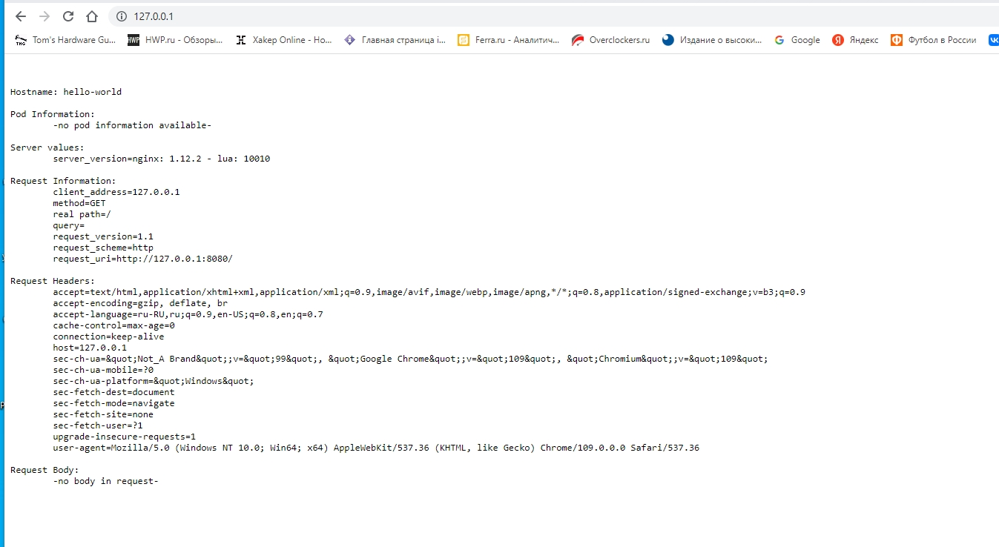

# Домашнее задание к занятию "Базовые объекты K8S" dev-17_kuber-homeworks-1.2-yakovlev_vs
kuber-homeworks-1.2


### Цель задания

В тестовой среде для работы с Kubernetes, установленной в предыдущем ДЗ, необходимо развернуть Pod с приложением и подключиться к нему со своего локального компьютера. 

------

### Чеклист готовности к домашнему заданию

1. Установленное k8s-решение (например, MicroK8S)
2. Установленный локальный kubectl
3. Редактор YAML-файлов с подключенным git-репозиторием

------

### Инструменты/ дополнительные материалы, которые пригодятся для выполнения задания

1. Описание [Pod](https://kubernetes.io/docs/concepts/workloads/pods/) и примеры манифестов
2. Описание [Service](https://kubernetes.io/docs/concepts/services-networking/service/)

------

### Задание 1. Создать Pod с именем "hello-world"

#### Решение

1. Создать манифест (yaml-конфигурацию) Pod

```bash
apiVersion: v1
kind: Pod
metadata:
  name: hello-world
spec:
  containers:
  - name: hello-world
    image: gcr.io/kubernetes-e2e-test-images/echoserver:2.2
    ports:
    - containerPort: 80
```

2. Использовать image - gcr.io/kubernetes-e2e-test-images/echoserver:2.2

```bash
kubectl get pods -o wide
NAME                     READY   STATUS    RESTARTS      AGE    IP             NODE       NOMINATED NODE   READINESS GATES
hello-574ff85cdb-rjdpd   1/1     Running   1 (18m ago)   71m    10.1.128.210   microk8s   <none>           <none>
hello-world              1/1     Running   1 (18m ago)   64m    10.1.128.215   microk8s   <none>           <none>
nginx-748c667d99-wzr9k   1/1     Running   2 (18m ago)   3d5h   10.1.128.211   microk8s   <none>           <none>
```


3. Подключиться локально к Pod с помощью `kubectl port-forward` и вывести значение (curl или в браузере)




------

### Задание 2. Создать Service и подключить его к Pod

#### Решение

1. Создать Pod с именем "netology-web"
2. Использовать image - gcr.io/kubernetes-e2e-test-images/echoserver:2.2

```bash
apiVersion: v1
kind: Pod
metadata:
  labels:
    app: netology
  name: netology-web

spec:
  containers:
  - name: netology-web
    image: gcr.io/kubernetes-e2e-test-images/echoserver:2.2
```

```bash
$kubectl get pods -o wide
NAME                     READY   STATUS    RESTARTS      AGE    IP             NODE       NOMINATED NODE   READINESS GATES
hello-574ff85cdb-rjdpd   1/1     Running   1 (94m ago)   147m   10.1.128.210   microk8s   <none>           <none>
hello-world              1/1     Running   1 (94m ago)   140m   10.1.128.215   microk8s   <none>           <none>
nginx-748c667d99-wzr9k   1/1     Running   2 (94m ago)   3d6h   10.1.128.211   microk8s   <none>           <none>
netology-web             1/1     Running   0             20m    10.1.128.220   microk8s   <none>           <none>
```

3. Создать Service с именем "netology-svc" и подключить к "netology-web"


4. Подключиться локально к Service с помощью `kubectl port-forward` и вывести значение (curl или в браузере)

```bash
$ curl http://localhost


Hostname: netology-web                
                                      
Pod Information:                      
        -no pod information available-

Server values:
        server_version=nginx: 1.12.2 - lua: 10010

Request Information:
        client_address=127.0.0.1
        method=GET
        real path=/
        query=
        request_version=1.1
        request_scheme=http
        request_uri=http://localhost:8080/

Request Headers:
        accept=*/*
$ kubectl get pos
error: the server doesn't have a resource type "pos"
```

------

### Правила приема работы

1. Домашняя работа оформляется в своем  Git репозитории в файле README.md. Выполненное домашнее задание пришлите ссылкой на .md-файл в вашем репозитории.
2. Файл README.md должен содержать скриншоты вывода команд `kubectl get pods`, а также скриншот результата подключения
3. Репозиторий должен содержать файлы манифестов и ссылки на них в файле README.md

------

### Критерии оценки
Зачет - выполнены все задания, ответы даны в развернутой форме, приложены соответствующие скриншоты и файлы проекта, в выполненных заданиях нет противоречий и нарушения логики.

На доработку - задание выполнено частично или не выполнено, в логике выполнения заданий есть противоречия, существенные недостатки.